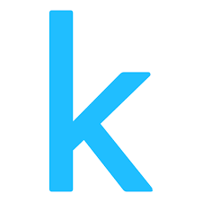

<h1 align="center">👋 Hi, I'm Mostafa Aly</h1>

---

## 🚀 About Me  
- 🎓 Graduate in Computer Science and Artificial Intelligence  
- 🤖 Passionate about Artificial Intelligence, Machine Learning, and Data Science  
- 💻 Always building and experimenting with real-world projects  
- 📊 Experienced with Python, SQL, Power BI, and modern AI frameworks  
- 🌱 Currently exploring Flutter, Dart, and full-stack development  
 

---

## 📫 Contact Me  

  
  &nbsp;
  
  &nbsp;
  

 
---

 ## 💻 Programming Languages  

  

